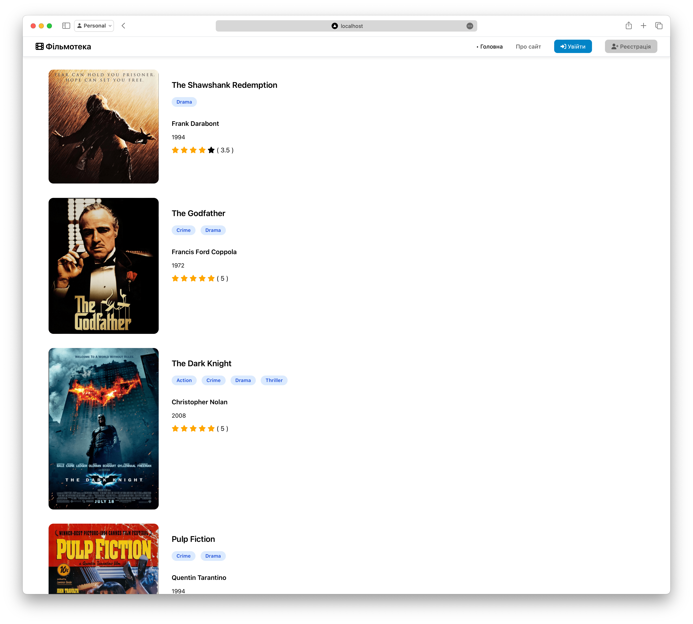

# Приклад інтерфейсу для бібліотеки фільмів

## Завдання

Каталог фільмів з оцінюванням. Створити сайт з каталогом фільмів. Кожен фільм має назву, опис, режисера, список акторів та жанрів, рік виходу та зображення. Головна сторінка сайту повинна відображати список фільмів та дозволити їх пошук за назвою, описом, режисером чи будь-ким з акторів. Необхідно також додати сторінку з детальною інформацією про фільми з можливістю для зареєстрованих користувачів залишати коментарі під ними та виставляти рейтинг фільму від 1 до 10. Також зареєстровані користувачі можуть додати фільм до одного з двох списків: “Вже переглянуто” та “Варто подивитись”. 
Передбачити користувача з правами адміністратор, в якого буде можливість додавати, змінювати та видаляти фільми.

Необхідно дозволити реєстрацію нових користувачів за електронною адресою та паролем.

Ролі користувачів:
 - 	незареєстрований користувач може продивлятись список фільмів та користуватись пошуком
 - 	зареєстрований користувач може коментувати фільми, ставити оцінку фільму, додавати фільм в власні списки
 - 	адміністратор має можливість додавати та видаляти фільми

Передбачена кількість активних користувачів сайту до 5000, кількість фільмів до 20000, адміністраторів до 20.

## Запуск

Необхідно встановити [Node.js](https://nodejs.org/en/download/package-manager) та [Yarn](https://yarnpkg.com/getting-started/install).
Також проект інтегровано з Strapi сервером, який необхідно підняти й налаштувати у .env файлі:

```
API_URL=http://localhost:1337
API_TOKEN='взяти токен з адмінки Strapi'
```

Далі для запуску проекту виконати наступні команди:

```bash
yarn install
yarn start
```

## Технології

Проект використовує мінімальний набір технологій. Серед них:
- Strapi для зберігання даних
- express.js для серверної частини
- axios HTTP-клієнт
- [Embedded Javascript Templates](https://ejs.co) для рендерингу сторінок

## Вигляд

Головна сторінка:



Сторінка фільму:

